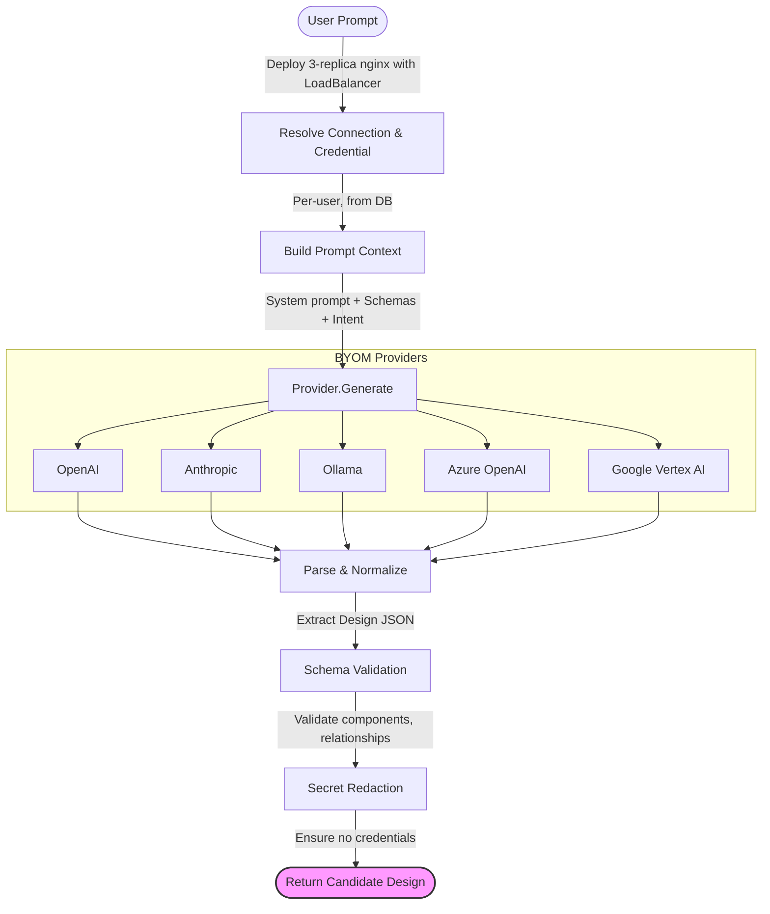

# Meshery AI Adapter — BYOM: Bring Your Own Model

> **CNCF LFX Mentorship 2026 Term 3 — Proof of Concept**
>
> Natural-language to infrastructure: user-owned AI provider connections with end-to-end Design generation.

[](https://go.dev)
[](https://meshery.io)
[](LICENSE)

---

## 🎯 What This PoC Demonstrates

This proof of concept implements the complete path from **user-supplied AI credentials → NL prompt → LLM call → candidate Design → schema validation → human review**, addressing all five expected outcomes of the mentorship project:

| # | Expected Outcome | Status |
|---|---|---|
| 1 | Connection & Credential support for 5+ provider kinds | ✅ OpenAI, Anthropic, Ollama, Azure OpenAI, Google Vertex AI |
| 2 | Create Connection wizard + health checks with operationId | ✅ Multi-step wizard + per-provider health checks |
| 3 | End-to-end NL→Design generation with validation | ✅ Full pipeline with schema validation |
| 4 | Provider swap (hosted ↔ local) with secret redaction | ✅ Verified by tests |
| 5 | Documentation covering setup, credential contract, privacy | ✅ Included |

## 🏗 Architecture



### Provider Abstraction (BYOM)

```go
type Provider interface {
    ID() ProviderKind
    Name() string
    HealthCheck(ctx context.Context) (*HealthStatus, error)
    Generate(ctx context.Context, req *GenerateInput) (*GenerateOutput, error)
}
```

Swapping providers requires only changing the Connection — no code changes:

```bash
# Use OpenAI
mesheryctl-ai connection create --kind openai --api-key sk-... --model gpt-4o

# Swap to local Ollama — same API, same pipeline, data stays local
mesheryctl-ai connection create --kind ollama --model llama3.1
```

## 🚀 Quick Start

### Prerequisites

- Go 1.22+
- (Optional) An OpenAI/Anthropic API key for live generation
- (Optional) Ollama running locally for private inference

### Run the Server

```bash
cd meshery-ai-adapter-poc
go mod tidy
go run .
```

Server starts at `http://localhost:9082` with the embedded UI.

### Run Tests

```bash
# All tests
go test ./internal/ai/... -v

# Secret redaction tests only
go test ./internal/ai/ -run TestRedact -v

# Provider swap tests only
go test ./internal/ai/ -run TestProviderSwap -v

# Pipeline integration tests
go test ./internal/ai/ -run TestPipeline -v
```

### Build the CLI

```bash
go build -o mesheryctl-ai ./cmd/mesheryctl-ai/
./mesheryctl-ai --help
```

### CLI Usage

```bash
# List supported providers
./mesheryctl-ai providers

# Create an Ollama connection (local, no API key needed)
./mesheryctl-ai connection create --kind ollama --name "Local Ollama" --model llama3.1

# Create an OpenAI connection
./mesheryctl-ai connection create --kind openai --name "My OpenAI" --api-key sk-... --model gpt-4o

# List connections
./mesheryctl-ai connection list

# Run health check
./mesheryctl-ai connection health <connection-id>

# Generate a Design
./mesheryctl-ai generate --prompt "Deploy nginx with 3 replicas and a LoadBalancer" --conn <connection-id>

# Generate and save to file
./mesheryctl-ai generate --prompt "HA Redis cluster with 3 replicas" --conn <id> --output design.json
```

## 🔐 Security Contract

This PoC enforces the same security guarantees required by the full Meshery implementation:

| Guarantee | Implementation |
|---|---|
| Secrets encrypted at rest | In-memory store (PoC); Meshery uses encrypted DB |
| Secrets never returned to clients | `Credential.Secret` has `json:"-"` tag; API returns `CredentialResponse` with `has_secret` flags only |
| Secrets never in prompt context | `BuildPromptContext()` constructs prompts from templates — never injects credentials |
| Secrets never in generated Designs | `RedactSecrets()` applied to all LLM output before returning |
| Secrets never in logs | All log statements use safe projections |
| Secrets never in events | `RedactSecrets()` applied to health check messages and error responses |

### Redaction Verification

```bash
go test ./internal/ai/ -run TestRedact -v
# TestRedactSecrets_BasicRedaction
# TestRedactSecrets_MultipleSecrets
# TestRedactSecrets_SecretInJSON
# TestRedactSecrets_SecretInDesignYAML
# TestRedactSecrets_NeverLeaksInHealthResponse
# TestRedactSecrets_NeverLeaksInLogOutput
```

## 📁 Project Structure

```
meshery-ai-adapter-poc/
├── main.go                          # Server entry point
├── go.mod
│
├── internal/
│   ├── ai/
│   │   ├── provider.go              # Provider interface (BYOM core)
│   │   ├── registry.go              # Provider registry & factory
│   │   ├── openai.go                # OpenAI provider
│   │   ├── openai_test.go           # OpenAI tests
│   │   ├── anthropic.go             # Anthropic Claude provider
│   │   ├── anthropic_test.go        # Anthropic tests
│   │   ├── ollama.go                # Ollama local provider
│   │   ├── ollama_test.go           # Ollama tests
│   │   ├── azure_openai.go          # Azure OpenAI provider
│   │   ├── azure_openai_test.go     # Azure OpenAI tests
│   │   ├── vertex_ai.go             # Google Vertex AI provider
│   │   ├── vertex_ai_test.go        # Google Vertex AI tests
│   │   ├── context.go               # System prompt & schema context
│   │   ├── pipeline.go              # NL→Design generation pipeline
│   │   ├── pipeline_test.go         # Pipeline generation tests
│   │   ├── redaction.go             # Secret redaction utilities
│   │   ├── redaction_test.go        # Secret redaction tests
│   │   └── provider_swap_test.go    # Provider swap & integration tests
│   │
│   ├── models/
│   │   ├── connection.go            # Connection & Credential models
│   │   ├── design.go                # Design, Component, Relationship models
│   │   └── design_test.go           # Design schema tests
│   │
│   ├── handlers/
│   │   ├── handlers.go              # HTTP API handlers
│   │   └── handlers_test.go         # API handler tests
│   │
│   └── store/
│       ├── store.go                 # In-memory store (PoC)
│       └── store_test.go            # Store tests
│
├── cmd/
│   └── mesheryctl-ai/
│       └── main.go                  # CLI tool
│
├── ui/
│   ├── index.html                   # UI: Connection wizard + generation
│   ├── styles.css                   # Premium dark-mode design system
│   └── app.js                       # Frontend application
│
└── docs/
    ├── provider-setup.md            # Provider setup guide
    ├── credential-contract.md       # Credential & privacy docs
    └── production-checklist.md      # AI production checklist
```

## 🔌 API Reference

| Method | Endpoint | Description |
|--------|----------|-------------|
| `GET` | `/api/ai/providers` | List supported provider kinds |
| `POST` | `/api/ai/connections` | Create a new AI connection |
| `GET` | `/api/ai/connections` | List all AI connections |
| `GET` | `/api/ai/connections/:id` | Get a connection |
| `DELETE` | `/api/ai/connections/:id` | Delete a connection |
| `GET` | `/api/ai/connections/:id/health` | Run health check |
| `POST` | `/api/ai/credentials` | Create a credential (secret stored server-side) |
| `GET` | `/api/ai/credentials` | List credentials (secrets masked) |
| `DELETE` | `/api/ai/credentials/:id` | Delete a credential |
| `POST` | `/api/ai/generate` | Generate Design from natural language |

## 🗺️ Roadmap to Full Meshery Integration

This PoC is designed to map directly onto Meshery's existing architecture:

| PoC Component | Meshery Integration Point |
|---|---|
| `Provider` interface | `server/internal/ai/provider.go` |
| `Registry` | Meshery Model Registry (auto-discovered) |
| `Connection` / `Credential` models | `meshery/schemas` JSON Schema definitions |
| In-memory `Store` | Meshery's encrypted database layer |
| HTTP handlers | `server/handlers/ai_handler.go` |
| UI wizard | `ui/components/connections/AIProviderConnectionWizard.js` |
| CLI tool | `mesheryctl/internal/cli/root/ai/` |
| System prompt | `server/internal/ai/prompt_templates/` |

## 📚 Documentation

- [Provider Setup Guide](docs/provider-setup.md) — Step-by-step for each provider
- [Credential Contract](docs/credential-contract.md) — Security & privacy guarantees
- [Production Checklist](docs/production-checklist.md) — Pre-deployment verification

## 📄 License

Apache License 2.0 — consistent with the Meshery project.
